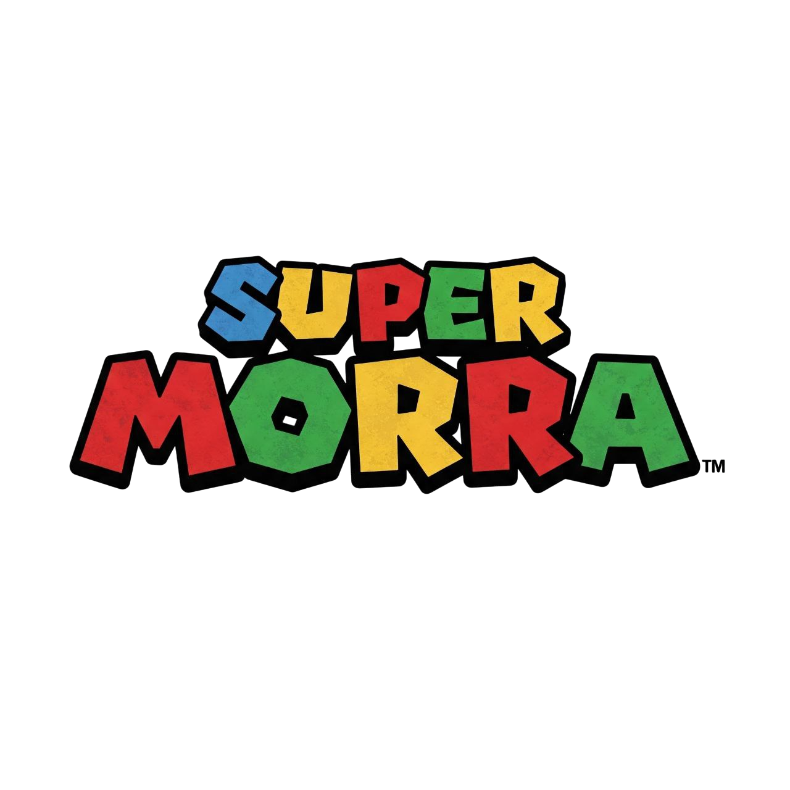

<p position="center">
   
</p>
The citizens of Morra De Sanctis suffer a severe asparagus omelette famine but one man is ready 
to do anything to help his people. Collect the "spalici" along the way, complete the levels but watch out for enemies.
This is a 2D platform built in Unity

## 🎮 Play the Game
You can play the game directly in your browser:
[Play Now](https://frapiocov.github.io/super-morra/)

## 🛠️ How to Play
- **Move**: `WASD` or arrow keys
- **Pause**: `P`
- **Jump**: Spacebar
- **Fire**: Tab

## 🚀 Installation & Running Locally
If you want to run the game locally, follow these steps:
1. Clone the repository:
   ```bash
   git clone https://github.com/frapiocov/super-morra.git
   ```
2. Open the project in Unity (tested with Unity version 2022.21.2)
3. Click **Play** in the Unity editor to test it

## 🖥️ Hosting on GitHub Pages
The game is built and deployed using Unity WebGL. To host your own version:
1. Build the game for WebGL (`File > Build Settings > WebGL`)
2. Upload the `Build` folder to your GitHub repository
3. Enable GitHub Pages in the repository settings

## 🔧 Technologies Used
- **Unity** (Game Engine)
- **C#** (Programming Language)
- **WebGL** (For browser playability)
- **GitHub Pages** (Hosting)

## 💡 Future Improvements
- More levels
- More weapon choices
- Improved animations

## 📜 License
This project is open-source under the [Apache License](LICENSE).

## 📩 Contact
For any issues or suggestions, feel free to reach out via GitHub Issues or email me at `francescop.covino@gmail.com`.

---
Enjoy the game! 🎯🔥

