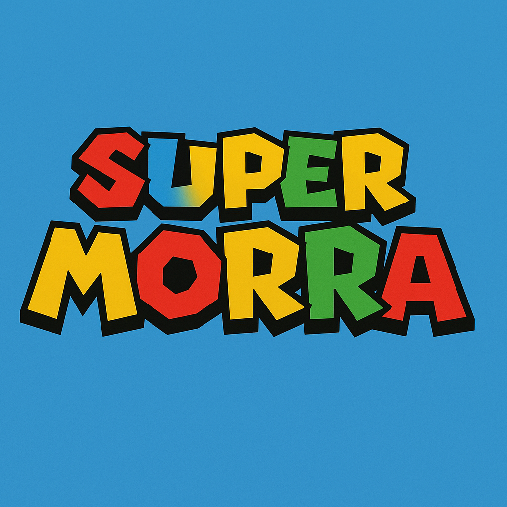

# Super Morra


🧟 Morra De Sanctis is overrun by asparagus, it's up to Spadino to catch them!

## 🎮 Play the Game
You can play the game directly in your browser:
[Play Now](YOUR_GITHUB_PAGES_LINK)

## 📖 About the Game
This is a 2D platform built in Unity.

### Features:
- 🎯 Third-person shooting mechanics
- 🏃‍♂️ Smooth character movement
- 🔫 Various weapons and shooting effects
- 🎵 Engaging sound effects and background music
- 🌍 Immersive 3D environment

## 🛠️ How to Play
- **Move**: `WASD` or arrow keys
- **Aim**: Move the mouse
- **Shoot**: Left mouse button
- **Reload**: `R`
- **Jump**: Spacebar
- **Sprint**: Shift

## 🚀 Installation & Running Locally
If you want to run the game locally, follow these steps:
1. Clone the repository:
   ```bash
   git clone https://github.com/YOUR_USERNAME/YOUR_REPO.git
   ```
2. Open the project in Unity (tested with Unity version X.X.X)
3. Click **Play** in the Unity editor to test it

## 🖥️ Hosting on GitHub Pages
The game is built and deployed using Unity WebGL. To host your own version:
1. Build the game for WebGL (`File > Build Settings > WebGL`)
2. Upload the `Build` folder to your GitHub repository
3. Enable GitHub Pages in the repository settings

## 🔧 Technologies Used
- **Unity** (Game Engine)
- **C#** (Programming Language)
- **WebGL** (For browser playability)
- **GitHub Pages** (Hosting)

## 💡 Future Improvements
- Multiplayer mode
- More weapon choices
- AI-powered enemies
- Improved animations

## 📜 License
This project is open-source under the [MIT License](LICENSE).

## 📩 Contact
For any issues or suggestions, feel free to reach out via GitHub Issues or email me at `your.email@example.com`.

---
Enjoy the game! 🎯🔥

